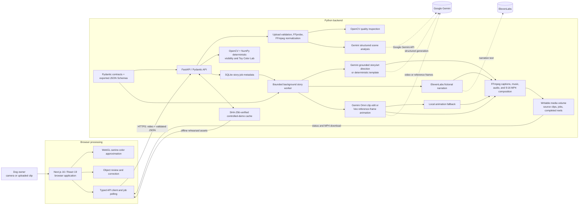

# PawSpective

See the world closer to how your dog sees it. PawSpective combines a
canine-vision approximation, reviewed AI scene analysis, deterministic
visibility scoring, color comparison, curiosity mapping, and downloadable
fictional Story Reels.

## What it does

- Opens a live Human/Dog Vision comparison or accepts a 5-15 second video.
- Detects visible objects with Gemini and lets the user correct the result.
- Measures foreground/background contrast with OpenCV and CIE Lab color.
- Shows possible attention cues in a timestamp-aligned Curiosity Map.
- Compares six screen colors in Toy Color Lab.
- Creates an 8-10 second animated dog-height POV reel with fictional narration.
- Supports a SHA-256-bound controlled demo for offline rehearsals.

PawSpective labels deterministic calculations as **Research-grounded**,
model interpretation as **AI-inferred**, and fictional output as
**Just for fun**. It does not claim exact canine vision, gaze, thoughts,
emotions, smell, intent, or behavioral diagnosis. See the
[AI disclosure](docs/AI_DISCLOSURE.md) for data flow, limitations, and provider
details.

## Architecture



The frontend can run on Vercel. The backend requires FFmpeg, writable
persistent storage, SQLite, and one long-running worker, so deploy it as the
included Docker container on a compatible host. The SQLite job store is not
designed for multiple backend replicas.

## Local development

Prerequisites: Node.js 22, Python 3.13, FFmpeg, and FFprobe.

```powershell
py -3.13 -m venv .venv
.\.venv\Scripts\Activate.ps1
python -m pip install --upgrade pip
python -m pip install -r requirements.txt
Copy-Item .env.example .env

Set-Location frontend
npm ci
Copy-Item .env.example .env.local
Set-Location ..
```

Add Gemini and ElevenLabs credentials to `.env` for live AI and voice calls.
Live animation also requires access to the configured Gemini Omni or Veo
preview model. Set `PAWSPECTIVE_DEMO_MODE=false` to use live providers. Never
commit `.env`, `.env.local`, API keys, uploads, generated audio, or reels.

Start the services in separate terminals:

```powershell
python -m uvicorn backend.app.main:app --reload --port 8000
```

```powershell
Set-Location frontend
npm run dev
```

Open `http://localhost:3000`. For container-based local development, configure
`.env` and run `docker compose up --build`.

## Configuration and deployment

The root [.env.example](.env.example) documents backend and Compose settings;
[frontend/.env.example](frontend/.env.example) documents the public API origin.
Production requires exact CORS origins, persistent `/data` storage, one backend
worker, and `NEXT_PUBLIC_API_BASE_URL` at frontend build time.

Controlled-demo support defaults to off. Enable it only after building and
deploying every verified cache asset. Existing saved demo visuals must remain
visibly labeled and must not be presented as a new live-model result.

Follow the [deployment guide](docs/deployment.md) for the full environment,
container, Vercel, health-check, and post-deployment procedure.

## Verification

```powershell
Set-Location frontend
npm run lint
npm run test
npm run build
Set-Location ..
python scripts/check_markdown_links.py
python -m pytest backend/tests
```

The GitHub Actions workflow also builds both production containers and runs a
Playwright smoke test against the Compose stack.

## Documentation

| Document | Purpose |
| --- | --- |
| [AI disclosure](docs/AI_DISCLOSURE.md) | AI providers, submitted data, safeguards, retention, and limitations |
| [Third-party notices](docs/THIRD_PARTY_NOTICES.md) | Dependency, media-tool, and hosted-service licensing notes |
| [Product contract](docs/product-contract.md) | Product claims, labels, grounding rules, and deferred scope |
| [Deployment guide](docs/deployment.md) | Production configuration and release procedure |
| [Controlled demo](docs/controlled-demo.md) | Fingerprinted offline rehearsal assets and cache generation |
| [Release checklist](docs/release-checklist.md) | Automated, browser, failure, privacy, and demo acceptance checks |

Released under the [MIT License](LICENSE).
